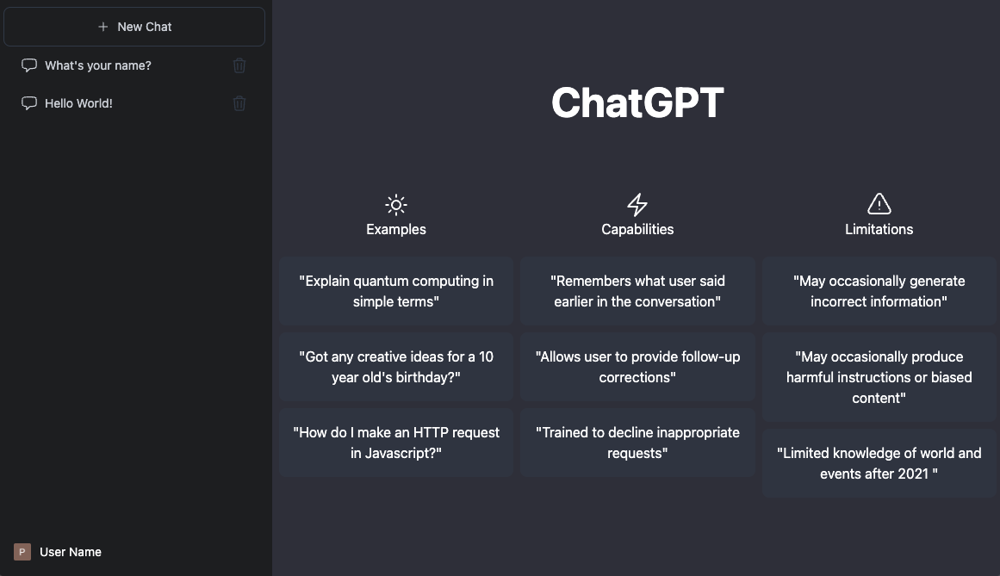
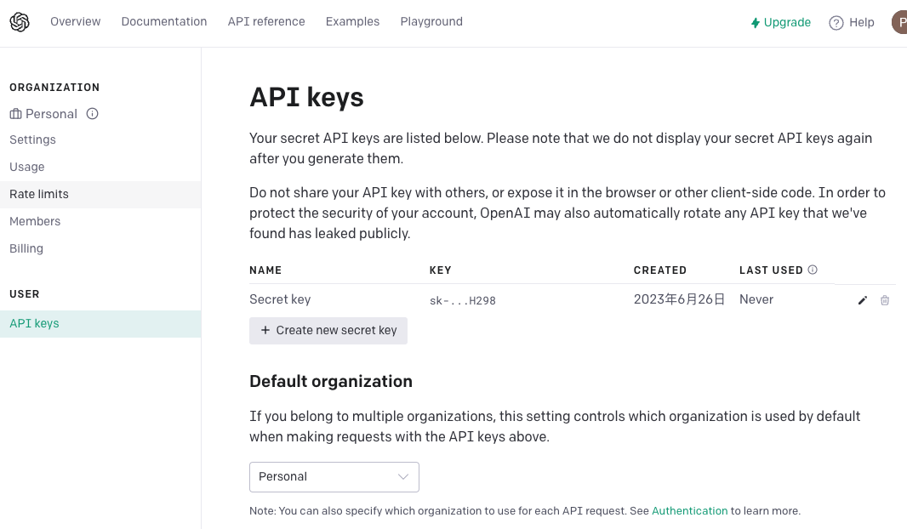
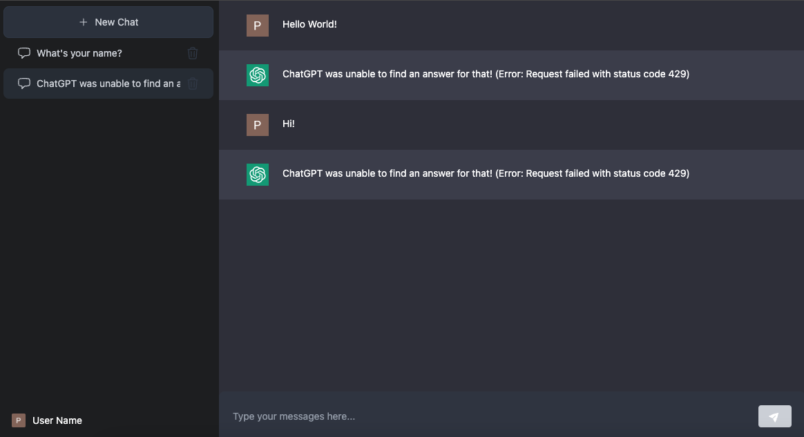

# Build ChatGPT messenger clone with Next.js



## Getting Started

Build a real-time chat web application with ChatGPT API. 

Feature:
* Use the ChatGPT API to create chat bot
* Secure API endpoint request
* Build a responsive site with Tailwind CSS
* Cloud Firestore Database
* Combine Server and Client Component

## OpenAI Manual

1. Install OpenAI Node.js Library
```bash
yarn add openai
```
2. Get openai key from url: [https://platform.openai.com/account/api-keys](https://platform.openai.com/account/api-keys)
3. Access to the openai api with openai key


### Error Code

*Status 429* : Too many requests 



